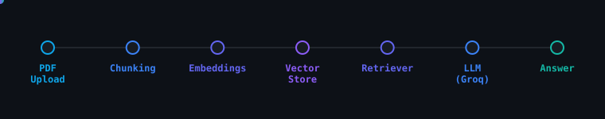

<div align="center">


# 

### Ask Questions Over PDFs Using Retrieval-Augmented Generation (RAG)

<p>
A production-inspired document intelligence system built with <b>FastAPI</b>, <b>LangChain</b>, <b>ChromaDB</b>, <b>React</b>, and <b>Groq</b>.
Upload a PDF, retrieve relevant context through semantic search, and generate grounded answers using an LLM.
</p>

<p>


</p>

</div>

---

## Overview

**PDF RAG Assistant** is a Retrieval-Augmented Generation (RAG) application that enables users to interact with PDF documents using natural language.

Instead of relying solely on an LLM's internal knowledge, the system retrieves the most relevant sections of the uploaded document through semantic similarity search and uses them as context for answer generation.

This retrieval-first workflow significantly reduces hallucinations and ensures responses remain grounded in the uploaded document.

---

## Demo Architecture

<p align="center">

</p>

---

# Key Features

### Document Processing

- Upload PDF documents
- Automatic text extraction
- Intelligent recursive chunking
- Embedding generation using HuggingFace models

### Semantic Retrieval

- Vector similarity search
- Top-k document retrieval
- Persistent ChromaDB storage
- Fast semantic lookup

### Grounded Generation

- Context-aware answers
- Hallucination reduction
- Explicit fallback when information is unavailable
- Groq-powered low latency inference

### Modern API

- FastAPI backend
- RESTful endpoints
- React frontend
- Easy deployment

---

# System Architecture

```text
                  Upload PDF
                       │
                       ▼
             PyPDFLoader (LangChain)
                       │
                       ▼
       RecursiveCharacterTextSplitter
        Chunk Size: 1000 | Overlap: 200
                       │
                       ▼
      HuggingFace Embedding Model
      BAAI/bge-small-en-v1.5
                       │
                       ▼
                Chroma Vector DB
              (Persistent Storage)
                       │
               Similarity Search
                  Top K = 4
                       │
                       ▼
         Retrieved Relevant Chunks
                       │
                       ▼
          LangChain Retrieval Chain
                       │
                       ▼
              ChatGroq (GPT-OSS)
                       │
                       ▼
               Grounded Response
```

---

# Tech Stack

| Category | Technologies |
|-----------|--------------|
| Backend | FastAPI, LangChain |
| Frontend | React.js |
| Vector Database | ChromaDB |
| Embeddings | HuggingFace BAAI/bge-small-en-v1.5 |
| LLM | Groq (GPT-OSS 20B) |
| Language | Python 3.10+, JavaScript |

---

# Retrieval Pipeline

```text
PDF
 │
 ▼
Load Document
 │
 ▼
Split into Chunks
 │
 ▼
Generate Embeddings
 │
 ▼
Store in ChromaDB
 │
 ▼
User Question
 │
 ▼
Similarity Search
 │
 ▼
Retrieve Top Context
 │
 ▼
LLM Generation
 │
 ▼
Answer
```

---

# Project Structure

```text
pdf-rag-assistant/
│
├── backend/
│   ├── main.py
│   ├── requirements.txt
│   ├── chroma_db/
│   └── uploads/
│
├── frontend/
│   ├── src/
│   ├── public/
│   └── package.json
│
├── assets/
│   └── architecture.svg
│
├── README.md
└── LICENSE
```

---

# API Endpoints

## Upload PDF

```http
POST /upload_pdf
```

Uploads a PDF document, extracts its text, generates embeddings, and stores them in the vector database.

### Request

```
multipart/form-data

file: sample.pdf
```

### Response

```json
{
  "message": "PDF uploaded successfully",
  "chunks": 42
}
```

---

## Ask Question

```http
POST /ask
```

Queries the indexed document using semantic retrieval.

### Request

```json
{
    "query":"What is the conclusion?"
}
```

### Response

```json
{
    "query":"What is the conclusion?",
    "answer":"..."
}
```

If no document has been uploaded, the API returns an appropriate error response.

---

## Health Check

```http
GET /
```

Returns a confirmation that the backend is running.

---

# Getting Started

## Clone Repository

```bash
git clone https://github.com/singhdeepesh20/pdf-rag-assistant.git

cd pdf-rag-assistant
```

---

## Backend Setup

```bash
cd backend

python -m venv venv
```

Activate virtual environment

### Windows

```bash
venv\Scripts\activate
```

### Linux / macOS

```bash
source venv/bin/activate
```

Install dependencies

```bash
pip install -r requirements.txt
```

Create a `.env` file

```env
GROQ_API_KEY=your_api_key
```

Run server

```bash
uvicorn main:app --reload
```

Backend

```
http://localhost:8000
```

---

## Frontend Setup

```bash
cd frontend

npm install

npm run dev
```

Frontend

```
http://localhost:5173
```

---

# RAG Configuration

| Component | Configuration |
|------------|---------------|
| Chunking Strategy | RecursiveCharacterTextSplitter |
| Chunk Size | 1000 |
| Chunk Overlap | 200 |
| Embedding Model | BAAI/bge-small-en-v1.5 |
| Retrieval Strategy | Similarity Search |
| Top K | 4 |
| Vector Database | ChromaDB |
| LLM | GPT-OSS-20B via Groq |

---

# Design Decisions

- Retrieval-Augmented Generation instead of direct prompting
- Persistent vector database to avoid repeated embedding generation
- Local vector storage for simple deployment
- FastAPI for lightweight backend APIs
- React SPA for responsive user interaction
- LangChain Retrieval Chain for orchestration
- Groq inference for low-latency response generation

---

# Future Improvements

- [ ] Multi-document retrieval
- [ ] Metadata filtering
- [ ] Source citations
- [ ] Streaming responses
- [ ] Hybrid Search (BM25 + Dense Retrieval)
- [ ] Reranking with Cross Encoder
- [ ] User authentication
- [ ] Cloud-hosted vector database
- [ ] Docker deployment
- [ ] Kubernetes support
- [ ] CI/CD pipeline
- [ ] Evaluation framework (RAGAS / DeepEval)

---

# License

This project is licensed under the **MIT License**.

See the [LICENSE](LICENSE) file for more information.

---

<div align="center">

### Built with FastAPI • LangChain • ChromaDB • React • Groq

⭐ If you found this project useful, consider giving it a star.

</div>

<div align="center">

</div>

